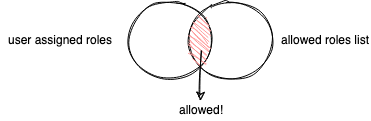

[Rego][rego] is a declarative language used to define policies in [Open Policy Agent (OPA)][opa]. This declarative language works defining queries that behaves like assertions over structured data stored in OPA.

In other words, we could said that OPA is the engine that interprets and evaluate policies written in Rego.

But, what is a Policy? an over-simplified analogy could be that a policy is a pre-condition: "a condition or predicate that must always be true prior the execution of something" [#][precondition].

An example of a policy could be: 

> Users can only buy if its profile has an address and a phone number

We could identify here a concrete action that is: "buy", but before that action occurs the following pre-conditions should be meet: 

- User profile must have an address
- User profile must have a phone number

In this particular case, rego assertions needs only to verify that a couple of fields contains some value, so, the final policy in rego looks like:

```rego
default profile_completed = false

profile_completed {
    count(input.phone) != 0
    count(input.address) != 0
}
```
<sup>see this example in action ▶️ [https://play.openpolicyagent.org/p/4k0TZcT1hy](https://play.openpolicyagent.org/p/4k0TZcT1hy)</sup>

Nevertheless, there are cases where expressions get more interesting, one of those cases is when you have to compare data collections with rego assertions.

One example of this type of policies is:

> Only authorised roles assigned to an user can access the content

## Rego collection data types

Collections ([Composite values][rego-comp-values]) in rego come in different flavours, has different built-in functions and syntactic sugar.

- Object/Dictionary/Map: key-valued collections > we will talk in another post about particular data type.
- Array: indexed collection
- Set: non-indexed/unordered collections of unique values

As you may noticed, there are substantial differences between Sets and Arrays, despite they use same representation when is serialised into JSON.

For the specific scenario that we are evaluating, values in the collection are the important ones, not so much where are they located at, which means, Sets will suit perfectly to write a policy and when you dig into built-in operations you will notice why too.

## Sets in Rego

### Declaring sets

First thing first, how does it look a [set][rego-sets] in rego?

```rego
// Set of primitive types
s := {"this", "is", "a", "set"}

s := {8,2,26}

// Set of complex types

s := {
	{"country":"🇨🇴"},
	{"country":"🇮🇪"}
}
```

Sets and arrays share a similar syntaxis, although Arrays use square brackets `[...]` and Sets use curly brackets `{...}`. Yes, objects in rego use curly brackets as well, but remember that objects are key-value collections.

### Equality

Here is where sets start to look interesting! since it contains only unique values the equality comparison is pretty simple

```rego
{1,2,3} == {3,1,2} // -> true
```

[2] Example taken from official documentation.

And yes, when you declare a set it just store unique values

```rego
s:= {1,1,2,2,3,3}
s == {3,2,1} // -> true
```

### Projection

You could create new sets based on subqueries using ["Comprehension"][rego-comprehension].

```rego
comp := { head | body ; condition<optional> } 
```

Tip: You could use comprehensions to create other Composite values like objects and arrays, structure is the same (head, body, condition), just take a look of specific syntaxis for each type.

- head → item to be taken for the new set.
- body → expression indicating where to extract the item.
- condition → if condition result is `true` the item will be added into the resulting set, otherwise is discarded.

## Intersection

When you have 2 sets, you could get the intersection from both sets using the binary operator `&`

```rego
french := { 
    "🇳🇪 Niger", 
    "🇨🇲 Cameroon", 
    "🇬🇳 Guinea", 
    "🇨🇦 Canada" 
}

english := { 
    "🇨🇲 Cameroon", 
    "🇮🇪 Ireland", 
    "🇳🇬 Nigeria", 
    "🇿🇦 South Africa", 
    "🇨🇦 Canada" 
}

english_and_french := english & french ## -->  { "🇨🇲 Cameroon", "🇨🇦 Canada" }
```

This intersection is precisely what we are looking to define a policy around the scenario proposed, let's take a look



Let's say for example that we have part of the content (what ever it is) and that content could be accessible for System Administrators and Publishers, so, the allowed set of roles could look like:

```rego
allowed_roles := { "admin", "publisher" }
```

And we are getting from the actual system that is validating content access against OPA the list of roles assigned to the logged user, so, we receive the following JSON:

```rego
{
    "username": "qjuanp",
    "roles": [ "writter", "publisher", "developer" ]
}
```

Knowing what is a set and how to use the intersection operation we could define the policy in rego as:

```rego
default allow = false # By default is not allowed

allow {
    user_roles := { role | role := input.roles[_] } # user roles came as an array, so let's create a set version
    user_allowed_roles := user_roles & allowed_roles
    count(user_allowed_roles) > 0 # final result of the alternative rule set `allow`
}

allowed_roles := { "admin", "publisher" }
```

<sup>see this example in action ▶️ [https://play.openpolicyagent.org/p/gjMYmbDg4C](https://play.openpolicyagent.org/p/gjMYmbDg4C)</sup>

It's important to transform arrays into sets to use properly sets operations, otherwise OPA won't tell you that there is an error and instead is going to use the unique values present in the array → indexes, which is going to mislead the rego policy evaluation.

Alongside with intersection there are two more interesting [bult-in operations][rego-sets-builtin-func] to work with sets: Minus (left join) and union, and other syntactic sugar "Rule Sets", but I will write about them in future notes, stay tuned.

> if you want to learn more in general about Rego, I'd recommend start with [this post][recommended-post-1]:

---

[👉 make a suggestion](https://github.com/qjuanp/qjuanp.github.io/issues/new?assignees=qjuanp&labels=review&template=post-feedback.md&title=%5Bpost+feedback%5D)
> If you want to help me with this post redaction don't hesitate on create an issue in the GitHub repo where it's hosted, use this link to get you there, and thanks!

---
[opa]: https://www.openpolicyagent.org/ "Open Policy Agent"
[rego]: https://www.openpolicyagent.org/docs/latest/#rego "Rego"
[precondition]: https://en.wikipedia.org/wiki/Precondition "Precondition"
[rego-comp-values]: https://www.openpolicyagent.org/docs/latest/policy-language/#composite-values "Composite Values"
[rego-sets]: https://www.openpolicyagent.org/docs/latest/policy-language/#sets "Policy Language → Composite Values → Sets"
[rego-comprehension]: https://www.openpolicyagent.org/docs/latest/policy-language/#set-comprehensions "Policy Language → Comprehensions → Set Comprehension"
[rego-sets-builtin-func]: https://www.openpolicyagent.org/docs/latest/policy-reference/#sets-2 "Policy Reference → Built-in functions → Sets"
[recommended-post-1]: https://blog.openpolicyagent.org/rego-design-principle-1-syntax-should-reflect-real-world-policies-e1a801ab8bfb "Rego design principle #1: Syntax should reflect real-world policies by Tim Hichrichs"