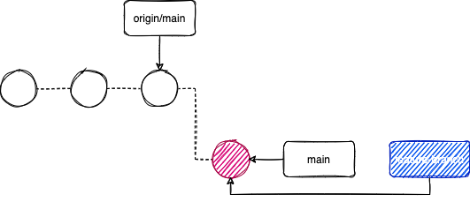
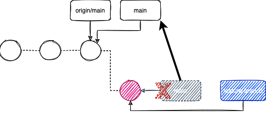

**Scenario:** main([*][1]) integration branch rejects changes when try to pushing into remote repository. This is a common practice to follow Gitflow (or other branching strategies) to enfornce merge reviews into the into the main branch.

So, how to push correctly your changes into main integration branch?

Summary:
1. [Create a feature branch](#create-a-feature-branch)
1. [Reset your local main integration branch and sync up with remote main branch](#reset-main)
1. [Push your feature branch and create a Pull Request](#push-your-feature-branch-and-create-a-pr)

## Create a feature branch

Create a feature branch from your main integration branch, remember that branches are just named pointers to actual commits, so, new branch will be poiting out to your latest changes, which are the ones you're trying to push correctly into the integration branch.

`git checkout -b [feature-branch-name]` 

> Remember to follow your defined naning standards to name the new feature branch.

## Reset main

Let's move the local main branch pointer to the same commit that remote branch is referencing. 

> In this example we assume that is just one commit behind the last commit, in that case we just need to run:

`git reset --hard HEAD~1`

Where:
- Reset will move the pointer
- `--hard` just move the pointer, discard all the changes
- `HEAD~1` one commit before current HEAD pointer

The result is something like this:

## Push your feature branch and create a PR

Now you can push your changes under the new branch:

`git push origin [feature-branch]`

And after that you will be able to create a PR to merge your changes with the main integration branch.

[1]: https://github.com/github/renaming (Renaming the default branch from master - extended expkanation by Github about why rename master as main in all repos)